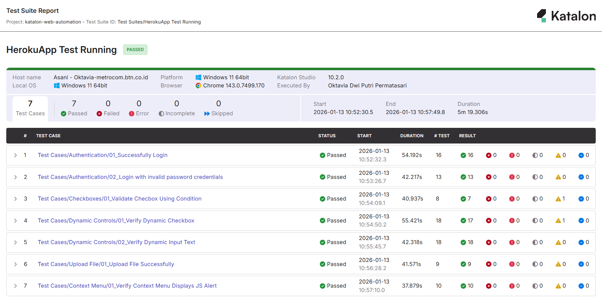

# Katalon Web Automation – The Internet (Heroku)

## 🚀 Project Overview

This repository contains a **Web UI Automation Testing project** built using **Katalon Studio**.  
The automation is implemented on the public demo website *The Internet (Heroku App)* — a popular practice site for UI automation.  
This project demonstrates **practical automation skills**, advanced test logic, and real-world WebUI handling for mid-level QA roles. :contentReference[oaicite:0]{index=0}

---

## 🌐 Application Under Test (AUT)

- **Website**: https://the-internet.herokuapp.com/ :contentReference[oaicite:1]{index=1}  
- The application provides various UI components suitable for automation, including:
  - JavaScript alerts (context menu)
  - Dynamic controls (input enable/disable)
  - Checkboxes & dropdowns
  - File upload/download
  - Authentication & form validation :contentReference[oaicite:2]{index=2}

---

## 🧰 Tools & Technologies

- **Katalon Studio** – automation IDE  
- **Groovy** – script language  
- **Selenium WebDriver** – underlying engine used by Katalon  
- **Object Repository** – reusable page objects  
- **Git & GitHub** – version control :contentReference[oaicite:3]{index=3}

---

## 📋 Test Scenarios Covered

### ✅ Web UI Automation (Script Mode)

The project includes scenarios such as:

- 🔹 Verify successful login / failure cases  
- 🔹 Handle **JavaScript alerts** (context menu)  
- 🔹 Validate **dynamic controls** (enable / disable input)  
- 🔹 Checkbox add / remove dynamic elements  
- 🔹 Verify field properties (disabled / enabled, input actions)  
- 🔹 Additional UI interactions (dropdowns, clicks, and hover behaviours) :contentReference[oaicite:4]{index=4}

Each test demonstrates best practices such as:
- **Explicit waits**
- **Conditional logic in tests**
- **Reusable custom keywords**
- **Verify element states (instead of static delays)**

---

## ▶️ How To Run

1. **Clone the repository**
   ```bash
   git clone https://github.com/oktaviadpp/katalon-web-automation.git

---

## 📊 Test Execution Report

Below are sample execution reports generated automatically by **Katalon Studio** after running the test cases.

### 🔹 Test Suite Summary

